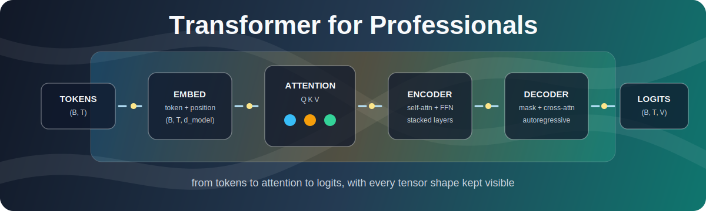

<div align="center">



# Transformer for Professionals

**A clean, modular PyTorch implementation of the original encoder-decoder Transformer, written from scratch and organized like production code.**

[](https://www.python.org/)
[](https://pytorch.org/)
[](tests/test_shapes.py)
[](#architecture-at-a-glance)

</div>

---

## Why This Repo Is Worth Your Time

Most professionals use Transformers through high-level libraries. That is productive, but it can also hide the mental model you need when something breaks, underperforms, or costs too much to run.

This repository gives you the Transformer architecture in a form you can actually read, debug, test, and extend. It keeps the math visible while organizing the code into professional modules: config, embeddings, attention, feed-forward layers, encoder, decoder, and the full model.

Go through this repo at least once if you work with LLMs, NLP systems, recommender models, sequence models, RAG pipelines, fine-tuning workflows, inference optimization, or ML platform code. It builds the kind of intuition that makes you faster when real production models stop behaving like the tutorial promised.

## What You Will Gain Professionally

| Benefit | Why it matters at work |
| --- | --- |
| **Deep architectural clarity** | Understand exactly how tokens become embeddings, how attention scores are computed, how heads are split and merged, and how encoder-decoder flow works. |
| **Better debugging instincts** | Shape mismatches, mask bugs, unstable logits, broken gradients, and sequence-length issues become easier to diagnose. |
| **Stronger code review skills** | You can review Transformer-based code with confidence instead of treating attention blocks as black boxes. |
| **Practical PyTorch fluency** | See how `nn.Module`, projections, residuals, LayerNorm, masks, and tensor reshaping fit together in a clean implementation. |
| **Interview and system-design leverage** | Explain Transformers from implementation details up to architecture-level tradeoffs. |
| **Foundation for customization** | Add dropout, training loops, different positional encodings, KV caching, tokenizer integration, or modern decoder-only variants from a solid base. |

## Architecture At A Glance

```text
source ids
   |
   v
InputEmbedding
   |
   v
TransformerEncoder
   |      target ids
   |          |
   |          v
   +----> TransformerDecoder
              |
              v
          Linear head
              |
              v
        vocabulary logits
```

The project implements the classic encoder-decoder stack:

- token and positional embeddings
- scaled dot-product attention
- manual multi-head attention with explicit Q/K/V projections
- causal masking for autoregressive decoder self-attention
- cross-attention from decoder to encoder output
- position-wise feed-forward networks
- residual connections with LayerNorm
- stacked encoder and decoder layers
- final projection to vocabulary logits

## Repository Layout

```text
transformer-for-professionals/
├── transformer/
│   ├── config.py       # TransformerConfig dataclass and derived head_dim
│   ├── embedding.py    # Token embedding, learned positions, sinusoidal_pe()
│   ├── attention.py    # scaled_dot_product(), MultiHeadAttention, causal_mask()
│   ├── layers.py       # FeedForward and AddNorm
│   ├── encoder.py      # EncoderLayer and TransformerEncoder
│   ├── decoder.py      # DecoderLayer and TransformerDecoder
│   ├── model.py        # Full encoder-decoder Transformer
│   └── __init__.py     # Public package exports
├── tests/
│   ├── test_shapes.py  # Shape contracts for each component
│   └── test_forward.py # End-to-end forward-pass checks
├── utils/
│   └── shapes.md       # Shape reference notes
├── requirements.txt
└── README.md
```

## Install

```bash
pip install -r requirements.txt
```

This project is currently designed to run from the repository root, so `transformer/` is importable without packaging boilerplate.

## Quickstart

```python
import torch

from transformer import Transformer, TransformerConfig

cfg = TransformerConfig(
    vocab_size=1000,
    d_model=128,
    num_heads=4,
    ff_dim=512,
    max_seq_len=512,
)

model = Transformer(cfg, num_layers=2)

src = torch.randint(0, cfg.vocab_size, (2, 10))  # (batch, encoder_tokens)
tgt = torch.randint(0, cfg.vocab_size, (2, 8))   # (batch, decoder_tokens)

logits = model(src, tgt)

print(logits.shape)  # torch.Size([2, 8, 1000])
```

## Core API

### `TransformerConfig`

Centralizes the model hyperparameters so experiments scale from one place.

```python
TransformerConfig(
    vocab_size=1000,
    d_model=8,
    num_heads=2,
    ff_dim=None,       # defaults to d_model * 4
    max_seq_len=100,
    dropout=0.0,       # placeholder for future training support
)
```

`head_dim` is derived as `d_model // num_heads`, and the config validates that `d_model` is divisible by `num_heads`.

### `MultiHeadAttention`

Implements attention with explicit projections:

```text
query/key/value -> Wq, Wk, Wv -> split heads -> scaled dot-product attention
                -> concat heads -> output projection
```

Shape contract:

```text
query:   (B, T_q,  d_model)
key:     (B, T_kv, d_model)
value:   (B, T_kv, d_model)
output:  (B, T_q,  d_model)
weights: (B, num_heads, T_q, T_kv)
```

### `TransformerEncoder`

Embeds source tokens and applies stacked encoder layers:

```text
token ids -> embedding -> self-attention -> AddNorm -> FFN -> AddNorm
```

### `TransformerDecoder`

Embeds target tokens and applies stacked decoder layers:

```text
target ids
  -> masked self-attention
  -> cross-attention over encoder output
  -> feed-forward
```

The decoder creates its causal mask internally based on the target sequence length.

### `Transformer`

The complete encoder-decoder model:

```python
logits = model(src_ids, tgt_ids)
```

Output shape:

```text
(batch, target_sequence_length, vocab_size)
```

## Tests

Run the focused shape regression suite:

```bash
python -m pytest tests/test_shapes.py
```

These tests verify the core tensor contracts across embeddings, attention, masks, feed-forward layers, encoder blocks, decoder blocks, and the full model.

## Design Choices

**Manual attention instead of `nn.MultiheadAttention`**  
The project keeps Q/K/V projections, head splitting, attention weights, concatenation, and output projection visible. That makes the implementation better for learning, debugging, and professional review.

**Shape contracts everywhere**  
Transformers are shape-sensitive systems. The tests and comments make tensor movement explicit so you can trace failures quickly.

**Config-driven architecture**  
Hyperparameters live in `TransformerConfig`, avoiding scattered magic numbers and making experiments easier to reason about.

**Reusable encoder and decoder blocks**  
Attention, feed-forward, AddNorm, encoder layers, and decoder layers are separated into focused modules. This mirrors how you would structure a real ML codebase.

**Causal masking handled inside the decoder**  
The decoder builds the autoregressive mask at runtime, so callers do not have to manually manage mask shape.

## What This Is Not

This is an architecture-first implementation. It is intentionally small and readable.

It does not yet include:

- tokenizer integration
- dataset loading
- training loop
- checkpointing
- inference decoding helpers
- KV cache
- production serving code

Those are excellent next steps once the architecture is clear.

## Suggested Learning Path

1. Start with `transformer/config.py` to understand the hyperparameters.
2. Read `transformer/embedding.py` to see how token IDs become vectors.
3. Spend real time in `transformer/attention.py`; this is the center of the project.
4. Move through `layers.py`, `encoder.py`, and `decoder.py`.
5. Finish with `model.py` to see the full encoder-decoder path.
6. Run `python -m pytest tests/test_shapes.py` and inspect each asserted shape.
7. Try changing `d_model`, `num_heads`, `ff_dim`, and `num_layers`.

## Ideas For Extension

- add dropout in attention, feed-forward, and residual paths
- add a training script on a tiny translation or copy task
- add tokenizer support
- add greedy decoding and beam search
- add learned vs sinusoidal positional encoding switches
- implement decoder-only GPT-style architecture
- add KV caching for faster autoregressive inference
- export attention maps for visualization

## Related Work

This professional package is the cleaned-up version of the step-by-step learning journey from:

[transformer-from-scratch](https://github.com/mutassimalzeem/transformer-from-scratch.git)

---

<div align="center">

**If you can read this repo comfortably, Transformer-based systems become much less mysterious.**

</div>
